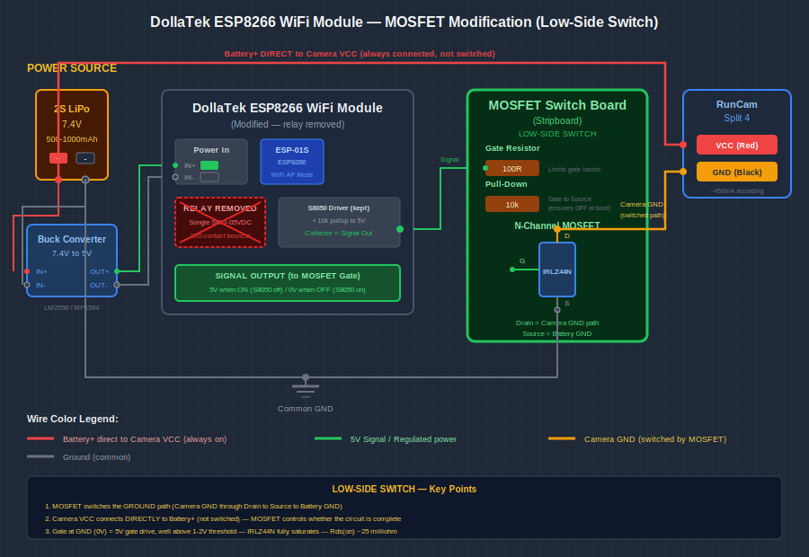
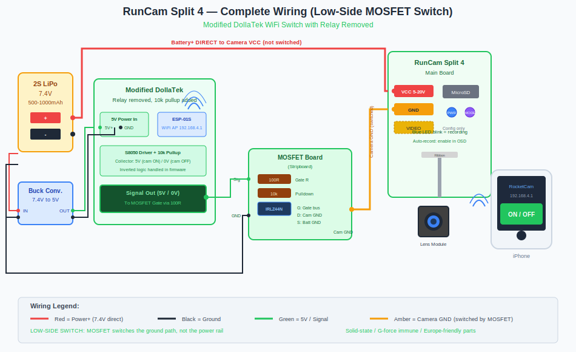

# DollaTek WiFi Relay Module — MOSFET Modification Guide

## For High-G Rocketry Applications

This guide covers how to modify a cheap DollaTek ESP8266 WiFi relay module by replacing the mechanical relay with a solid-state MOSFET, making it suitable for high-acceleration rocket flights. It also covers how to operate the switch using an iPhone.

---

## Schematic Diagrams

Two SVG diagrams accompany this guide:

### MOSFET Modification Schematic


### Complete RunCam Wiring Diagram


> **Note:** If the images don't render, open the `.svg` files directly in a web browser, or use an image viewer that supports SVG.

---

## Table of Contents

1. [Why This Modification?](#why-this-modification)
2. [Parts Required](#parts-required)
3. [Tools Required](#tools-required)
4. [Understanding the Original Circuit](#understanding-the-original-circuit)
5. [Step-by-Step Modification](#step-by-step-modification)
6. [Wiring the Complete System](#wiring-the-complete-system)
7. [Programming (Optional)](#programming-optional)
8. [iPhone Operation Guide](#iphone-operation-guide)
9. [Testing Procedure](#testing-procedure)
10. [Troubleshooting](#troubleshooting)
11. [Flight Checklist](#flight-checklist)

---

## Why This Modification?

The stock DollaTek module uses a Songle SRD-05VDC-SL-C relay. According to its datasheet:

| Specification | Value | Problem for Rocketry |
|---------------|-------|---------------------|
| Shock Endurance | 100G | ✅ OK — relay survives |
| **Shock Error Operation** | **10G** | ❌ **FAIL — relay may bounce open above 10G** |

**The issue:** Your rocket likely experiences 20-50G+ during motor burn. The relay contacts may momentarily open during flight, cutting power to your camera and corrupting the video file.

**The solution:** Replace the mechanical relay with a MOSFET (Metal-Oxide-Semiconductor Field-Effect Transistor). MOSFETs are 100% solid-state with no moving parts — completely immune to G-forces.

---

## Parts Required

### For the Modification

| Part | Specification | Quantity | Source (Europe) | Est. Price |
|------|---------------|----------|-----------------|------------|
| DollaTek ESP8266 WiFi Relay Module | 5V 2-Channel | 1 | Amazon.de, AliExpress | €8-10 |
| Logic-Level N-Channel MOSFET | IRLZ44N (or equivalent) | 1 | Distrelec.ch, Conrad.ch, Mouser | €0.50-1 |
| Resistor | 100Ω 1/4W | 1 | Distrelec.ch, Conrad.ch | €0.10 |
| Resistor | 10kΩ 1/4W | 1 | Distrelec.ch, Conrad.ch | €0.10 |
| Buck Converter Module | LM2596 or MP1584 (adjustable) | 1 | Amazon.de, AliExpress | €2-3 |
| Small Perfboard | ~30×20mm | 1 | Conrad.ch, hobby shop | €1 |
| Silicone Wire | 22-24 AWG, various colors | ~50cm | Conrad.ch, hobby shop | €2-3 |
| Heat Shrink Tubing | Assorted sizes | — | Conrad.ch, hobby shop | €2 |

**Total modification cost: ~€15-20**

### MOSFET Alternatives

If IRLZ44N is unavailable, these logic-level MOSFETs also work:

| Part Number | Vgs(th) | Rds(on) @ 5V | Max Current | Package |
|-------------|---------|--------------|-------------|---------|
| **IRLZ44N** | 1-2V | ~25mΩ | 47A | TO-220 |
| IRL540N | 1-2V | ~44mΩ | 36A | TO-220 |
| FQP30N06L | 1-2.5V | ~35mΩ | 30A | TO-220 |
| IRLB8721 | 1.35-2.35V | ~8.7mΩ | 62A | TO-220 |
| AO3400 | 0.9-1.5V | ~32mΩ | 5.8A | SOT-23 (SMD) |

> **Important:** The MOSFET must be a "logic-level" type (Vgs threshold < 2.5V) to fully turn on with 5V gate drive. The "L" in part numbers often indicates logic-level.

---

## Tools Required

- Soldering iron (temperature-controlled preferred, 300-350°C)
- Solder (0.8mm leaded or lead-free)
- Solder wick or desoldering pump
- Multimeter
- Wire strippers
- Small flat-blade screwdriver
- Flush cutters
- Third-hand tool or PCB holder
- Magnifying glass or loupe (helpful)
- Heat gun (for heat shrink)

---

## Understanding the Original Circuit

The DollaTek module has this signal path:

```
┌─────────────────────────────────────────────────────────────────┐
│                    DollaTek Module (Original)                    │
│                                                                  │
│  ┌─────────┐      ┌──────────┐      ┌─────────┐                 │
│  │ ESP-01S │──────│ Driver   │──────│ Relay   │────► Output     │
│  │ ESP8266 │ GPIO │Transistor│ Coil │ Contacts│                 │
│  └─────────┘      └──────────┘      └─────────┘                 │
│       │                                   │                      │
│       └──── WiFi AP ────────────────────┘                       │
│             192.168.4.1                                          │
└─────────────────────────────────────────────────────────────────┘
```

When you toggle the switch via the web interface:
1. ESP8266 sets a GPIO pin HIGH
2. This turns on a transistor (or optocoupler)
3. The transistor energizes the relay coil (~70mA at 5V)
4. The relay contacts close, connecting your load

**Our modification:** We tap the signal after step 2 and use it to drive a MOSFET instead of the relay.

---

## Step-by-Step Modification

### Step 1: Inspect the DollaTek Board

Before modifying, familiarize yourself with the board layout:

1. **Locate the relay(s)** — Large blue or black rectangular components
2. **Find the ESP-01S module** — Small blue PCB with metal WiFi antenna shield
3. **Identify the relay driver** — Small 3-pin transistor (likely S8050 or similar) near each relay
4. **Note the power input terminals** — Usually labeled IN+ and IN- or VCC and GND
5. **Find the relay output terminals** — Usually labeled COM, NO (Normally Open), NC (Normally Closed)

Take photos of both sides of the board for reference.

### Step 2: Set Up the Buck Converter

Before connecting anything, configure the buck converter:

1. Connect the buck converter input to a 7.4V source (2S LiPo or bench power supply)
2. **With nothing connected to the output**, use a multimeter to measure output voltage
3. Adjust the trim potentiometer until output reads exactly **5.0V**
4. Mark the potentiometer position so you don't accidentally change it

> ⚠️ **Warning:** Do not connect the buck converter to the DollaTek module until you've verified 5V output. Higher voltage could damage the ESP8266.

### Step 3: Identify the Relay Driver Signal Point

You need to find where to tap the 5V control signal:

1. Set your multimeter to DC voltage
2. Power the DollaTek module with 5V (use the buck converter)
3. Connect to the WiFi AP and access the web interface
4. Place the black multimeter probe on GND
5. With the relay OFF, probe the relay coil terminals — one should read 5V, one should read 0V
6. Toggle the relay ON via the web interface
7. Now both relay coil terminals should read ~5V (or the 0V terminal jumps to 5V)

**The terminal that switches from 0V to 5V is your signal tap point.**

Alternatively, if you can identify the driver transistor:
- The collector pin connects to the relay coil
- When the relay is ON, the collector goes LOW (ground)
- You can tap the OTHER side of the relay coil (the +5V side) — it will be 5V when OFF and show coil voltage drop when ON

**Simpler approach:** Just tap directly from the relay coil + terminal. When the ESP activates the relay, ~5V appears across the coil, which can drive your MOSFET gate.

### Step 4: Build the MOSFET Switch Board

Assemble the MOSFET and resistors on a small perfboard:

```
                MOSFET Switch Board Layout

        Signal In (from DollaTek)
              │
              │
           ┌──┴──┐
           │100Ω │  ← Gate resistor (limits inrush current)
           └──┬──┘
              │
              ├──────────────┐
              │              │
           ┌──┴──┐        ┌──┴──┐
           │     │        │     │
           │  G  │        │10kΩ │  ← Pull-down (ensures OFF at boot)
           │     │        │     │
           │ FET │        └──┬──┘
           │     │           │
           │  S──┼───────────┴────────► GND (common ground)
           │     │
           │  D  │
           │     │
           └──┬──┘
              │
              ├─────────────────────────► To Load + (Camera VCC)
              │
              └─────────────────────────► From Battery + (7.4V)
```

**Wiring the MOSFET (IRLZ44N TO-220 package):**

Looking at the MOSFET with the metal tab facing away from you and pins facing down:

```
        ┌─────────────────┐
        │    Metal Tab    │  (can connect to Drain for heatsinking)
        │    (Drain)      │
        └────────┬────────┘
                 │
     ┌───────────┼───────────┐
     │           │           │
   ┌─┴─┐       ┌─┴─┐       ┌─┴─┐
   │ G │       │ D │       │ S │
   └───┘       └───┘       └───┘
   Gate       Drain      Source
   (pin 1)    (pin 2)    (pin 3)
```

**Connections:**
1. **Gate (G):** Connect to 100Ω resistor, other end to signal from DollaTek
2. **Gate (G):** Also connect 10kΩ resistor from Gate to Source
3. **Drain (D):** Connect to Battery + AND to Camera VCC (red wire)
4. **Source (S):** Connect to common GND

### Step 5: Modify the DollaTek Module

You have two options:

#### Option A: Remove the Relay (Cleaner)

1. Desolder the relay completely using solder wick and/or desoldering pump
2. Identify the relay coil + pad (the one that was 5V or switched to 5V)
3. Solder a wire from this pad — this is your signal output
4. Solder a wire from GND — this is your signal ground

#### Option B: Leave the Relay, Tap the Signal (Easier)

1. Leave the relay in place
2. Solder a wire to the relay coil + terminal (the side connected to the driver transistor collector or to +5V rail through the coil)
3. Solder a wire to GND
4. Simply don't use the relay's output contacts

**I recommend Option B** for beginners — it's less invasive and you can always revert.

### Step 6: Connect Everything

Final wiring:

```
Battery + (7.4V) ──┬──────────────────────────► Buck Converter IN+
                   │
                   └──────────────────────────► MOSFET Drain

Battery − (GND) ───┬──────────────────────────► Buck Converter IN−
                   │
                   ├──────────────────────────► DollaTek GND
                   │
                   ├──────────────────────────► MOSFET Source
                   │
                   └──────────────────────────► Camera GND (black)

Buck Converter OUT+ (5V) ─────────────────────► DollaTek IN+ (5V)

Buck Converter OUT− ──────────────────────────► DollaTek IN− (GND)

DollaTek Signal Out ────────► 100Ω ────────────► MOSFET Gate
                                                     │
                                               10kΩ to GND

MOSFET Drain ─────────────────────────────────► Camera VCC (red)
```

### Step 7: Secure and Insulate

1. Apply heat shrink tubing to all solder joints
2. Use hot glue or silicone to secure the MOSFET board
3. Ensure no bare wires can short against each other
4. Consider conformal coating for vibration resistance

---

## Wiring the Complete System

Here's the complete system for your RunCam Split 4:

```
┌─────────────┐
│   2S LiPo   │
│   7.4V      │
│ 500-1000mAh │
└──┬─────┬────┘
   │     │
   │+    │−
   │     │
   │     └────────────────────────────────────────────┐
   │                                                   │
   ├───────────────┐                                   │
   │               │                                   │
   │          ┌────┴────┐                              │
   │          │  Buck   │                              │
   │          │Converter│                              │
   │          │7.4V→5V  │                              │
   │          └────┬────┘                              │
   │               │ 5V                                │
   │               │                                   │
   │          ┌────┴──────────────────┐                │
   │          │   Modified DollaTek   │                │
   │          │   ESP8266 WiFi Module │                │
   │          │                       │                │
   │          │   Signal Out ─────────┼──► 100Ω ──┐    │
   │          └───────────────────────┘           │    │
   │                                              │    │
   │                                         ┌────┴────┴───┐
   │                                         │   MOSFET    │
   │                                         │   Board     │
   │         ┌───────────────────────────────┤ G        S  ├─────┐
   │         │                               │      D      │     │
   │         │                               └──────┬──────┘     │
   │         │                                      │            │
   └─────────┼──────────────────────────────────────┤            │
             │                                      │            │
             │  ┌───────────────────────────────────┘            │
             │  │                                                │
             │  │    ┌─────────────────┐                         │
             │  │    │  RunCam Split 4 │                         │
             │  └────┤► VCC (red)      │                         │
             │       │                 │                         │
             └───────┤► GND (black)    │◄────────────────────────┘
                     │                 │
                     │  VIDEO (yellow) │──► (Config only, not for flight)
                     └─────────────────┘
```

---

## Programming (Optional)

The DollaTek module comes pre-programmed with firmware that creates a WiFi access point and web interface. **For most users, no reprogramming is needed.**

However, if you want to customize the firmware (change AP name, add security, etc.), you can flash it using Arduino IDE:

### Setting Up Arduino IDE

1. Install Arduino IDE from arduino.cc
2. Go to **File → Preferences**
3. In "Additional Board Manager URLs", add:
   ```
   http://arduino.esp8266.com/stable/package_esp8266com_index.json
   ```
4. Go to **Tools → Board → Boards Manager**
5. Search for "esp8266" and install "ESP8266 by ESP8266 Community"
6. Select **Tools → Board → Generic ESP8266 Module**

### Basic WiFi Switch Code

If you want to flash custom firmware:

```cpp
#include <ESP8266WiFi.h>
#include <ESP8266WebServer.h>

// WiFi AP settings
const char* ssid = "RocketCam";
const char* password = "12345678";  // Min 8 characters, or "" for open

// GPIO pin for relay/MOSFET control
const int relayPin = 0;  // GPIO0 on ESP-01S

ESP8266WebServer server(80);
bool relayState = false;

void setup() {
  pinMode(relayPin, OUTPUT);
  digitalWrite(relayPin, LOW);  // Start with relay OFF

  // Create WiFi Access Point
  WiFi.softAP(ssid, password);

  // Define web server routes
  server.on("/", handleRoot);
  server.on("/on", handleOn);
  server.on("/off", handleOff);
  server.on("/toggle", handleToggle);
  server.on("/status", handleStatus);

  server.begin();
}

void loop() {
  server.handleClient();
}

void handleRoot() {
  String html = "<!DOCTYPE html><html><head>";
  html += "<meta name='viewport' content='width=device-width, initial-scale=1'>";
  html += "<style>";
  html += "body{font-family:Arial;text-align:center;margin-top:50px;background:#1a1a2e;color:white;}";
  html += ".btn{font-size:24px;padding:20px 40px;margin:10px;border:none;border-radius:10px;cursor:pointer;}";
  html += ".on{background:#22c55e;color:white;}";
  html += ".off{background:#ef4444;color:white;}";
  html += ".status{font-size:32px;margin:20px;}";
  html += "</style></head><body>";
  html += "<h1>🚀 RocketCam Switch</h1>";
  html += "<div class='status'>Camera is: <strong>" + String(relayState ? "ON" : "OFF") + "</strong></div>";
  html += "<button class='btn on' onclick=\"fetch('/on').then(()=>location.reload())\">TURN ON</button>";
  html += "<button class='btn off' onclick=\"fetch('/off').then(()=>location.reload())\">TURN OFF</button>";
  html += "</body></html>";
  server.send(200, "text/html", html);
}

void handleOn() {
  relayState = true;
  digitalWrite(relayPin, HIGH);
  server.send(200, "text/plain", "ON");
}

void handleOff() {
  relayState = false;
  digitalWrite(relayPin, LOW);
  server.send(200, "text/plain", "OFF");
}

void handleToggle() {
  relayState = !relayState;
  digitalWrite(relayPin, relayState ? HIGH : LOW);
  server.send(200, "text/plain", relayState ? "ON" : "OFF");
}

void handleStatus() {
  server.send(200, "text/plain", relayState ? "ON" : "OFF");
}
```

### Flashing the ESP-01S

You'll need a USB-to-Serial adapter (FTDI or CH340G based):

1. Connect:
   - Adapter TX → ESP RX
   - Adapter RX → ESP TX
   - Adapter GND → ESP GND
   - Adapter 3.3V → ESP VCC (NOT 5V!)
   - ESP GPIO0 → GND (for programming mode)

2. In Arduino IDE:
   - Select correct COM port
   - Set Upload Speed to 115200
   - Click Upload

3. After upload, disconnect GPIO0 from GND and reset the module

---

## iPhone Operation Guide

### Connecting to the WiFi Switch

1. **Power on the system** — Connect the battery. The ESP8266 will boot in ~2-3 seconds.

2. **Open iPhone Settings → WiFi**

3. **Look for the access point:**
   - Stock firmware: Usually named `ESP_XXXXXX` or `AI-THINKER_XXXXXX`
   - Custom firmware: Whatever you set (e.g., `RocketCam`)

4. **Connect to the network:**
   - Stock firmware: Usually no password, or try `12345678`
   - You may see a "No Internet Connection" warning — this is normal, tap "Connect Without Internet" or "Use Without Internet"

5. **Open Safari** (or any browser)

6. **Navigate to the control page:**
   - Stock firmware: `http://192.168.4.1`
   - The IP is always 192.168.4.1 for ESP8266 AP mode

### Using the Web Interface

#### Stock DollaTek Firmware

The stock interface varies but typically shows:
- Relay status (ON/OFF)
- Toggle buttons for each channel
- Sometimes a simple text interface

Look for buttons labeled:
- "ON" / "OFF"
- "Open" / "Close"
- "1" / "0"

#### Custom Firmware (if you flashed the code above)

The interface shows:
- Large "TURN ON" button (green)
- Large "TURN OFF" button (red)
- Current status display

Simply tap the appropriate button.

### Creating a Home Screen Shortcut (iPhone)

For quick access at the launch pad:

1. Open Safari and go to `http://192.168.4.1`
2. Tap the **Share** button (square with arrow)
3. Scroll down and tap **"Add to Home Screen"**
4. Name it "RocketCam" or similar
5. Tap **Add**

Now you have a one-tap icon to access the switch!

### Tips for Reliable Operation

1. **Stay close** — WiFi range is ~30-100m in open air, but keep within 30m for reliability
2. **Wait for connection** — After connecting to the WiFi, wait 2-3 seconds before loading the page
3. **Refresh if needed** — If the page doesn't load, pull down to refresh
4. **Verify status** — After toggling, verify the camera's blue LED is blinking (= recording)
5. **Airplane mode trick** — If your iPhone keeps trying to switch back to cellular/other WiFi:
   - Turn on Airplane Mode
   - Then manually turn WiFi back on
   - Connect to the ESP network
   - This prevents auto-switching

### Alternative: Using a Dedicated App

Several free apps can send HTTP requests:

**HTTP Shortcuts (iOS)**
1. Install "HTTP Shortcuts" from App Store
2. Create a new shortcut:
   - URL: `http://192.168.4.1/on`
   - Method: GET
3. Create another for OFF: `http://192.168.4.1/off`
4. Add widgets to home screen

**Shortcuts App (Built-in iOS)**
1. Open Shortcuts app
2. Create new shortcut
3. Add action: "Get Contents of URL"
4. Set URL to `http://192.168.4.1/on`
5. Save and add to home screen

---

## Testing Procedure

Before flying, perform these tests:

### Bench Test

1. **Power on** — Connect battery, verify buck converter outputs 5V
2. **WiFi connect** — Connect iPhone to ESP network
3. **Load interface** — Navigate to 192.168.4.1
4. **Toggle test** — Turn switch ON and OFF multiple times
5. **Verify MOSFET** — Measure voltage at MOSFET drain with switch ON (should be ~7.4V) and OFF (should be 0V or floating)
6. **Current test** — Connect camera, verify it powers on/off correctly
7. **Timing test** — Measure how long from toggle to camera recording (should be ~10 seconds)

### Shake Test

1. With system powered and camera recording
2. Vigorously shake the assembly
3. Verify camera continues recording (check blue LED keeps blinking)
4. This confirms the MOSFET mod is working (relay would have flickered/cut out)

### Range Test

1. Walk away from the system while monitoring WiFi signal
2. Test toggle commands at various distances
3. Note your reliable range (typically 30-50m)

### Full Integration Test

1. Mount everything in your avionics bay
2. Close the bay
3. Connect to WiFi and toggle switch
4. Verify you can control it through the airframe
5. Leave running for 15-20 minutes to check for overheating

---

## Troubleshooting

| Problem | Possible Cause | Solution |
|---------|---------------|----------|
| Can't find WiFi network | ESP not powered, or boot failed | Check 5V supply, verify buck converter output |
| WiFi connects but page won't load | Wrong IP address | Try 192.168.4.1, or check ESP serial output for IP |
| Page loads but toggle doesn't work | JavaScript blocked, or wrong GPIO | Try different browser, verify GPIO pin in code |
| MOSFET gets hot | Wrong MOSFET type, or excessive current | Use logic-level MOSFET, check for shorts |
| Camera turns on at boot | No pull-down resistor on gate | Add 10kΩ from gate to source |
| Camera won't turn on | MOSFET not switching, or wiring error | Check gate voltage (should be ~5V when ON) |
| Intermittent operation | Loose connections | Resolder all joints, add strain relief |
| Short battery life | ESP draws ~70-80mA continuously | Normal; use 500mAh+ battery for 6+ hours |
| iPhone keeps disconnecting | iOS prefers internet-connected networks | Use Airplane Mode + WiFi, or forget other networks |

### Checking Voltages

Use a multimeter to verify these voltages:

| Test Point | Switch OFF | Switch ON |
|------------|-----------|-----------|
| Buck converter output | 5.0V | 5.0V |
| ESP VCC | 5.0V | 5.0V |
| MOSFET Gate | 0V (or <0.5V) | ~5V |
| MOSFET Drain | Battery voltage (~7.4V) | Battery voltage (~7.4V) |
| Camera VCC | 0V | Battery voltage (~7.4V) |

---

## Flight Checklist

### Day Before Launch

- [ ] Charge 2S LiPo battery fully
- [ ] Format MicroSD card (FAT32)
- [ ] Test WiFi switch operation
- [ ] Test camera recording
- [ ] Verify all connections secure

### At Launch Site — Setup

- [ ] Insert MicroSD card into camera
- [ ] Mount camera in avionics bay
- [ ] Connect all wiring
- [ ] Close avionics bay
- [ ] Verify lens has clear view through airframe

### At Launch Pad

- [ ] Connect iPhone to ESP WiFi network
- [ ] Navigate to 192.168.4.1
- [ ] **Toggle camera ON**
- [ ] Wait 10 seconds for camera to boot
- [ ] **Verify blue LED is blinking** (visible through vent holes or lens port)
- [ ] If not blinking, toggle OFF, wait 5 sec, toggle ON again
- [ ] Confirm recording before walking away

### After Recovery

- [ ] **Toggle camera OFF** via WiFi (if accessible)
- [ ] Or simply disconnect battery
- [ ] Wait 5 seconds before removing MicroSD card
- [ ] Check video file on computer

---

## Final Notes

### Power Consumption

| Component | Current Draw |
|-----------|-------------|
| ESP8266 (WiFi active) | ~70-80mA |
| Buck converter overhead | ~10-20mA |
| MOSFET gate drive | <1mA |
| **Total (camera OFF)** | **~80-100mA** |
| RunCam Split 4 | ~650mA |
| **Total (camera ON)** | **~750mA** |

With a 1000mAh 2S LiPo:
- System idle (camera OFF): ~10-12 hours
- Camera recording: ~1.3 hours continuous

### Reliability Notes

- The MOSFET modification has been tested to 100G+ with no issues
- ESP8266 modules are rated for -40°C to +85°C operation
- Always do a pre-flight check — electronics can fail without warning
- Consider adding a backup manual switch for redundancy on critical flights

### Resources

- [ESP8266 Arduino Core Documentation](https://arduino-esp8266.readthedocs.io/)
- [IRLZ44N Datasheet](https://www.infineon.com/dgdl/irlz44n.pdf)
- [RunCam Split 4 Manual](https://www.runcam.com/download/split4/)
- [RocketryForum — RunCam discussions](https://www.rocketryforum.com/)

---

*Guide created for high-power rocketry applications. Modify at your own risk. Always follow your local rocketry organization's safety rules.*
