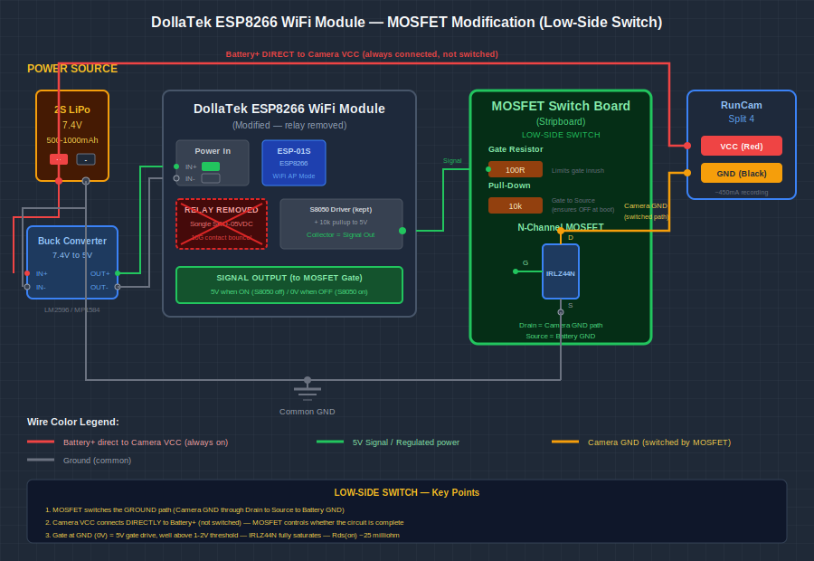
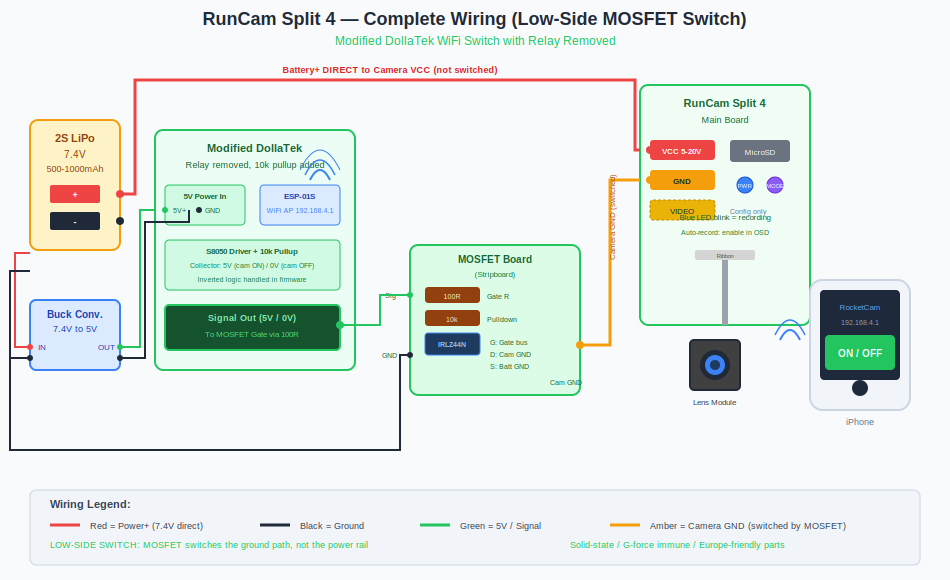

# DollaTek WiFi Relay — MOSFET Modification Guide

## For RunCam Split 4 in High-G Rocketry

This guide walks through four practical steps:
1. Setting up WiFi connectivity to the DollaTek module from an iPhone
2. Removing the mechanical relay from the board
3. Building a prototype solid-state switching circuit on stripboard
4. Connecting and testing the complete system with a RunCam Split 4

---

## Schematic Diagrams

### MOSFET Modification Schematic


### Complete RunCam Wiring Diagram


> **Note:** If the images don't render, open the `.svg` files directly in a web browser.

---

## Why This Modification?

The stock DollaTek module uses a Songle SRD-05VDC-SL-C relay:

| Specification | Value | Problem for Rocketry |
|---------------|-------|---------------------|
| Shock Endurance | 100G | OK — relay survives |
| **Shock Error Operation** | **10G** | **FAIL — contacts bounce open above 10G** |

Your rocket likely pulls 20-50G+ during motor burn. The relay contacts may momentarily open, cutting power to the camera and corrupting the video file. A MOSFET is 100% solid-state — completely immune to G-forces.

---

## Parts Required

| Part | Specification | Qty | Est. Price |
|------|---------------|-----|------------|
| DollaTek ESP8266 WiFi Relay Module | ESP-01S based, 5V | 1 | €8-10 |
| Logic-Level N-Channel MOSFET | IRLZ44N (TO-220) | 1 | €0.50-1 |
| Resistor | 10kΩ 1/4W | 2 | €0.20 |
| Resistor | 100Ω 1/4W | 1 | €0.10 |
| Buck Converter | LM2596 or MP1584 (adjustable) | 1 | €2-3 |
| Stripboard (Veroboard) | ~30×20mm minimum | 1 | €1 |
| Silicone Wire | 22-24 AWG, red/black/green | ~50cm | €2-3 |
| Heat Shrink Tubing | Assorted | — | €2 |
| USB-to-Serial Adapter | FTDI or CH340G (3.3V) | 1 | €3-5 |

**Total: ~€20-30**

### MOSFET Alternatives

| Part Number | Vgs(th) | Rds(on) @ 5V | Package |
|-------------|---------|--------------|---------|
| **IRLZ44N** | 1-2V | ~25mΩ | TO-220 |
| IRL540N | 1-2V | ~44mΩ | TO-220 |
| IRLB8721 | 1.35-2.35V | ~8.7mΩ | TO-220 |

The MOSFET must be "logic-level" (Vgs threshold < 2.5V) to fully turn on with 5V gate drive. The "L" in part numbers often indicates logic-level.

### Tools

- Soldering iron (300-350°C), solder (0.8mm)
- Solder wick or desoldering pump
- Multimeter
- Wire strippers, flush cutters
- Third-hand tool or PCB holder

---

## Part 1: Setting Up WiFi Connectivity (iPhone)

### 1.1 Identify Your Board Version

The DollaTek module comes in two main variants:

| Feature | v1.0 Board | v4.0 Board |
|---------|-----------|-----------|
| Relay driver | S8050 NPN transistor | PC817 optocoupler |
| GPIO logic | Active HIGH (HIGH = relay ON) | Active LOW (LOW = relay ON) |
| Isolation | None | Optocoupler-isolated |

Both use the ESP-01S module (the small blue board with the metal WiFi antenna shield). The version affects which signal tap point you'll use later.

### 1.2 Power On and Check for WiFi

1. **Set up the buck converter first** (see Part 4.1 for details, or use a bench supply set to 5.0V)
2. Connect 5V to the DollaTek's IN+ and GND to IN-
3. The ESP-01S blue LED should flash briefly during boot (~2-3 seconds)

### 1.3 Connect from iPhone

1. Open **Settings → WiFi** on your iPhone
2. Look for a network named one of:
   - `ESP_XXXXXX` (where XXXXXX are hex digits)
   - `AI-THINKER_XXXXXX`
   - `RocketCam` (if someone already flashed custom firmware)
3. Tap to connect. If prompted for a password, try `12345678` (or it may be open)
4. **iOS will warn "No Internet Connection"** — tap **"Use Without Internet"** or **"Connect Without Internet"**
5. Open Safari and navigate to: **`http://192.168.4.1`**

The IP 192.168.4.1 is always the same — it's the default for ESP8266 Access Point mode.

**If you see a web page with toggle buttons:** Your module has a web-capable firmware. You can skip to step 1.5.

**If the page doesn't load or shows garbled text:** Your module has stock AT firmware (serial-only, no web server). You need to flash custom firmware — continue to step 1.4.

### 1.4 Flash Custom Firmware (if needed)

Most DollaTek modules ship with stock AT firmware that has **no web interface**. You must flash custom firmware to get WiFi control from a phone.

#### Install Arduino IDE and ESP8266 Support

1. Install Arduino IDE from [arduino.cc](https://www.arduino.cc/en/software)
2. Go to **File → Preferences**
3. In "Additional Board Manager URLs", add:
   ```
   http://arduino.esp8266.com/stable/package_esp8266com_index.json
   ```
4. Go to **Tools → Board → Boards Manager**
5. Search "esp8266", install **"ESP8266 by ESP8266 Community"**
6. Select **Tools → Board → Generic ESP8266 Module**

#### Wiring the USB-to-Serial Adapter

Remove the ESP-01S from the DollaTek board (it plugs into a header). Connect to your USB-to-Serial adapter:

```
USB-Serial Adapter          ESP-01S
─────────────────          ──────────
TX          ──────────────  RX
RX          ──────────────  TX
GND         ──────────────  GND
3.3V        ──────────────  VCC  (NOT 5V — 5V will destroy the ESP!)
                            GPIO0 ──── GND  (connects to GND for programming mode)
```

> **Warning:** The ESP-01S runs on 3.3V. Connecting 5V to VCC will permanently damage it.

#### Flash the Firmware

Copy the firmware code from [Appendix A](#appendix-a-custom-firmware) into a new Arduino IDE sketch.

1. Select the correct COM/serial port under **Tools → Port**
2. Set **Upload Speed** to **115200**
3. Click **Upload**
4. Wait for "Done uploading" message
5. Disconnect GPIO0 from GND
6. Reconnect the ESP-01S to the DollaTek board
7. Power cycle — the module now broadcasts a "RocketCam" WiFi network

### 1.5 iPhone Tips for Reliable Connection

**Problem:** iOS aggressively disconnects from WiFi networks that have no internet, switching back to cellular or other known networks.

**Solution 1 — Airplane Mode (most reliable):**
1. Enable **Airplane Mode**
2. Manually re-enable **WiFi** (tap the WiFi icon in Control Center)
3. Connect to the RocketCam network
4. iOS has no cellular fallback, so it stays connected

**Solution 2 — Disable WiFi Assist:**
1. Go to **Settings → Cellular** → scroll to bottom
2. Turn off **WiFi Assist**
3. This is device-wide, so remember to re-enable after your launch

**Solution 3 (built into the custom firmware):**
The firmware in Appendix A includes a DNS server and captive-portal response that satisfies iOS connectivity checks. After flashing it, iOS should stay connected without workarounds.

### 1.6 Create a Home Screen Shortcut

For quick access at the launch pad:

1. In Safari, navigate to `http://192.168.4.1`
2. Tap the **Share** button (square with arrow)
3. Tap **"Add to Home Screen"**
4. Name it "RocketCam", tap **Add**

**Alternative — iOS Shortcuts app:**
1. Open the Shortcuts app
2. Create a new shortcut → add **"Get Contents of URL"**
3. Set URL to `http://192.168.4.1/on`
4. Save as "Camera ON" and add to home screen
5. Repeat with `/off` for a "Camera OFF" shortcut

---

## Part 2: Removing the Relay

### 2.1 Understand the Signal Path

The DollaTek board's signal chain:

```
ESP-01S GPIO0 ──► Base Resistor ──► S8050 NPN ──► Relay Coil ──► 5V Rail
                                     (collector)    (energizes)
```

When GPIO0 goes HIGH:
1. S8050 turns ON, collector pulls LOW (~0.2V)
2. Current flows through the relay coil (from 5V rail → coil → collector → GND)
3. Relay contacts close

After relay removal, we repurpose the S8050 collector as a 5V signal source.

### 2.2 Photograph and Probe

Before desoldering anything:

1. **Take photos** of both sides of the board
2. Set multimeter to DC voltage, black probe on GND
3. Power the board, connect to WiFi, load the web interface
4. **Relay OFF:** Probe the relay terminals. Find the one connected to the S8050 collector — it should read ~5V (pulled up through the coil to the 5V rail)
5. **Relay ON (toggle via web):** That same terminal should drop to ~0.2V (S8050 conducting)
6. **Mark this pad** — it's your signal output after relay removal

The other relay coil terminal connects to the 5V rail and always reads ~5V.

### 2.3 Desolder the Relay

1. Secure the board in a third-hand tool
2. Apply flux to the relay's through-hole solder joints
3. Heat each pin from the bottom (copper side) while applying solder wick, or use a desoldering pump
4. The relay has 5 pins: 2 coil pins + 3 contact pins (COM, NO, NC)
5. Once all pins are free, gently lift the relay off the board
6. Clean the pads with solder wick and isopropyl alcohol

### 2.4 Add the Pullup Resistor

With the relay removed, the S8050 collector pad is floating when the transistor is off. Add a pullup resistor to create a clean 5V signal:

1. Solder a **10kΩ resistor** between:
   - The **S8050 collector pad** (the relay coil terminal that switched voltage, marked in step 2.2)
   - The **5V rail pad** (the other relay coil terminal, always at 5V)
2. Keep the resistor body flat against the board to save space

**How the signal now works:**

| ESP Command | GPIO0 | S8050 | Collector (Signal Out) | Meaning |
|-------------|-------|-------|----------------------|---------|
| "OFF" | HIGH* | ON | ~0.2V (pulled LOW) | Camera OFF |
| "ON" | LOW* | OFF | 5V (pulled HIGH by 10kΩ) | Camera ON |

*Note the inverted logic — the custom firmware handles this. See Appendix A.

### 2.5 Solder the Signal Output Wires

Solder two short wires (~10cm, 24 AWG) to the DollaTek board:

1. **Signal wire (green):** Solder to the S8050 collector pad (now your 5V signal output)
2. **GND wire (black):** Solder to any GND pad on the board

These connect to the MOSFET switch board you'll build next.

---

## Part 3: Building the MOSFET Switch on Stripboard

### 3.1 Circuit Design: Low-Side N-Channel Switch

The MOSFET switches the **ground path** (low side) of the camera power:

```
                                        ┌─────────────────────┐
                                        │   RunCam Split 4    │
Battery + (7.4V) ──────────────────────►│ VCC (red)           │
                                        │                     │
                                        │ GND (black) ────────┤
                                        └─────────────────────┘
                                                              │
Signal from DollaTek                                          │
         │                                                    │
      ┌──┴──┐                                                 │
      │100Ω │  Gate resistor                                  │
      └──┬──┘                                                 │
         │                                                    │
         ├────────────┐                                       │
         │            │                                       │
      ┌──┴──┐      ┌──┴──┐                                   │
      │  G  │      │10kΩ │  Gate-to-Source pulldown            │
      │     │      └──┬──┘                                    │
      │ FET │         │                                       │
      │     │         │                                       │
      │  D──┼─────────┼───────────────────────────────────────┘
      │     │         │          Camera GND goes through Drain
      │  S──┼─────────┘
      └─────┘         │
                      │
                      ▼
                Battery GND ─────────────────────────────────────
```

**When Gate = HIGH (5V):** MOSFET channel conducts. Camera GND connects to Battery GND through Drain→Source. Current flows, camera is powered.

**When Gate = LOW (0V):** MOSFET channel is off. Camera GND is floating (disconnected from Battery GND). No current path, camera is off.

**Why low-side?** An N-channel MOSFET needs the gate voltage to be higher than the source to turn on. With the source at GND (0V), a 5V gate signal gives Vgs = 5V — well above the 1-2V threshold. A high-side configuration would need the gate above 7.4V, which the DollaTek's 5V signal can't provide.

### 3.2 MOSFET Pinout

IRLZ44N TO-220 package — viewed from the front (label facing you), pins pointing down:

```
         ┌─────────────────┐
         │    Metal Tab     │  (internally connected to Drain)
         │                  │
         └────────┬─────────┘
                  │
      ┌───────────┼───────────┐
      │           │           │
    ┌─┴─┐      ┌─┴─┐      ┌─┴─┐
    │ G │      │ D │      │ S │
    └───┘      └───┘      └───┘
   Pin 1      Pin 2      Pin 3
   Gate       Drain      Source
```

### 3.3 Stripboard Layout

Cut a small piece of stripboard: **5 columns × 4 rows** minimum (plus margins). Copper tracks run **horizontally** (left to right). View from the **component side** (copper is underneath).

```
Stripboard — Component Side View
(copper tracks run left-right on the underside)

        Col 1    Col 2    Col 3    Col 4    Col 5
       ─────────────────────────────────────────────
Row A:   ●────────●────────●────────●────────●       Signal In
                           ┊                         (100Ω mounted
                           ┊ 100Ω                     vertically)
Row B:   ●────────●────────●────────●────────●       Gate bus
                                    │        ┊
                                  ┌─┤        ┊ 10kΩ
                                  │G│        ┊ (vertical)
                                  │ │        ┊
Row C:   ●────────●────────●────────●────────●       Drain bus
                                  │D│                 (Camera GND)
                                  │ │
Row D:   ●────────●────────●────────●────────●       Source / GND
                                  │S│
                                  └─┘
                               IRLZ44N
                             (standing up,
                              tab facing away)
```

#### Component Placement Table

| Component | Pin 1 Location | Pin 2 Location | Notes |
|-----------|---------------|---------------|-------|
| **Signal wire** (green) | A1 | — | From DollaTek collector pad |
| **100Ω resistor** | A3 | B3 | Vertical, bridges Row A → Row B |
| **MOSFET Gate** | B4 | — | IRLZ44N pin 1 |
| **MOSFET Drain** | C4 | — | IRLZ44N pin 2 |
| **MOSFET Source** | D4 | — | IRLZ44N pin 3 |
| **10kΩ resistor** | B5 | D5 | Vertical, bridges Row B → Row D (passes over Row C in the air) |
| **Camera GND wire** (black) | C1 | — | To RunCam black wire |
| **Battery GND wire** (black) | D1 | — | To battery negative |

#### Track Cuts

No track cuts are required for this minimal layout. Each row serves a single function:
- Row A: Signal input only (wire at A1, resistor at A3)
- Row B: Gate bus (resistor at B3, MOSFET gate at B4, pulldown at B5)
- Row C: Drain / Camera GND (MOSFET drain at C4, camera wire at C1)
- Row D: Source / System GND (MOSFET source at D4, pulldown at D5, GND wire at D1)

### 3.4 Soldering the Board

1. **Insert the MOSFET** first. Stand it upright at column 4 with the metal tab facing away from you. Bend each lead to reach its row:
   - Gate lead bends slightly left to Row B, hole B4
   - Drain lead goes straight down to Row C, hole C4
   - Source lead bends slightly right to Row D, hole D4

2. **Solder the MOSFET** leads on the copper side. Trim excess leads.

3. **Insert and solder the 100Ω resistor** vertically between A3 and B3.

4. **Insert and solder the 10kΩ resistor** vertically between B5 and D5. The resistor body arches over Row C without touching it.

5. **Solder wires:**
   - Green signal wire at A1
   - Black camera GND wire at C1
   - Black battery GND wire at D1

6. **Inspect** all joints under magnification. Check for solder bridges between adjacent tracks.

### 3.5 Test the Bare Board

Before connecting to the camera, verify the MOSFET switches correctly:

1. Connect battery GND wire (D1) to the negative terminal of a bench supply or battery
2. Set multimeter to **continuity/resistance** mode
3. Probe between the Camera GND wire (C1) and Battery GND wire (D1)

**Gate LOW (no signal):**
- Should read **open circuit** (OL / infinite resistance)
- The 10kΩ pulldown holds the gate at 0V → MOSFET is off

**Gate HIGH (apply 5V to signal wire at A1):**
- Touch signal wire to 5V → should read **< 1Ω** between C1 and D1
- The MOSFET channel conducts → Drain connects to Source

**Remove the 5V:**
- Should immediately return to **open circuit**

If this works, your MOSFET switch board is ready.

---

## Part 4: Connecting Everything and Testing with the RunCam

### 4.1 Set Up the Buck Converter

The DollaTek module needs 5V. Your battery is 7.4V. The buck converter steps down the voltage.

1. Connect the buck converter input to a 7.4V source (2S LiPo or bench supply)
2. **With nothing connected to the output**, measure the output voltage with a multimeter
3. Turn the trim potentiometer until the output reads exactly **5.0V**
4. Mark the potentiometer position with a dot of paint or nail polish

> **Warning:** Verify 5V output before connecting to the DollaTek. Higher voltage will destroy the ESP8266.

### 4.2 Complete Wiring

```
                    ┌─────────────────────────────────────────────────────┐
                    │                                                     │
┌─────────────┐    │    ┌───────────┐    ┌──────────────────────┐        │
│   2S LiPo   │    │    │   Buck    │    │  Modified DollaTek   │        │
│   7.4V      │    │    │ Converter │    │  (relay removed)     │        │
│             +├────┼───►│IN+   OUT+│───►│5V IN                 │        │
│              │    │    │          │    │                      │        │
│             −├──┬─┼───►│IN−   OUT−│───►│GND      Signal Out──┼──►(A)  │
└──────────────┘  │ │    └──────────┘    └──────────────────────┘        │
                  │ │                                                     │
                  │ │                                                     │
                  │ │    ┌─────────────────────────────────┐              │
                  │ │    │   MOSFET Board (stripboard)     │              │
                  │ │    │                                 │              │
                  │ │    │  (A) Signal In ► 100Ω ► Gate   │              │
                  │ │    │                    10kΩ ┘       │              │
                  │ │    │                                 │              │
                  │ └───►│  GND (Source) ◄─────────────────┤              │
                  │      │                                 │              │
                  │      │  Camera GND (Drain) ────────────┼──►(B)       │
                  │      └─────────────────────────────────┘              │
                  │                                                       │
                  │      ┌─────────────────┐                              │
                  │      │  RunCam Split 4  │                             │
                  └─────►│  VCC (red) ◄────┼──────────────────────────────┘
                         │                 │      Battery+ direct to Camera VCC
                    (B)─►│  GND (black)    │
                         └─────────────────┘
```

**Wire-by-wire checklist:**

| Wire | From | To | Color | Notes |
|------|------|----|-------|-------|
| 1 | Battery + | Buck Converter IN+ | Red | Powers the DollaTek |
| 2 | Battery − | Buck Converter IN− | Black | |
| 3 | Buck OUT+ (5V) | DollaTek IN+ | Red | 5V regulated |
| 4 | Buck OUT− | DollaTek GND | Black | |
| 5 | Battery + | Camera VCC (red) | Red | **Direct connection — not switched** |
| 6 | Battery − | MOSFET Board GND (D1) | Black | MOSFET source to battery GND |
| 7 | DollaTek Signal Out | MOSFET Board Signal In (A1) | Green | 5V control signal |
| 8 | MOSFET Board Camera GND (C1) | Camera GND (black) | Black | **Switched ground path** |

**Key point:** The camera's VCC (red wire) connects directly to battery positive — it is always at 7.4V. The MOSFET switches the **ground path**. When the MOSFET turns on, the camera's ground completes the circuit and power flows.

### 4.3 Configure the RunCam Split 4

#### Auto-Record on Power

The RunCam Split 4 can automatically start recording when power is applied — no button press needed:

1. Connect the camera's video output (yellow wire) to a monitor via RCA or RCA-to-HDMI adapter
2. Power the camera and press the **MODE** button to enter the OSD menu
3. Navigate to **"Auto Recording"** and set it to **ON**
4. Save and exit the OSD menu
5. Power cycle the camera — it should start recording automatically after ~7-10 seconds

With auto-record enabled, the workflow becomes: toggle WiFi switch ON → camera boots → recording starts automatically.

#### Firmware Update (Split 4 V2 only)

**If you have the Split 4 V2**, update to firmware **v1.1.5 or later**. Earlier firmware has a bug where the power-off protection feature is broken — abruptly cutting power can corrupt the video file.

1. Download the firmware (`Split4g.BRN`) from [RunCam's download page](https://www.runcam.com/download/runcamsplit4v2)
2. Place the `.BRN` file on the root of the MicroSD card
3. Insert the card and power on the camera — it auto-updates
4. The file disappears from the card when the update completes

#### Power Specifications

| Parameter | Value |
|-----------|-------|
| Input voltage | DC 5-20V |
| Current draw (recording) | ~450mA @ 5V, proportionally less at higher voltages |
| Boot to recording time | ~7-10 seconds |
| Power-off protection | Yes (loses last ~3-4 seconds of footage) |
| MicroSD | Up to 128GB, Class 10 / U3 recommended |

### 4.4 Bench Test

With everything wired up:

1. **Power on** — Connect the battery
2. **Verify voltages** with a multimeter:

| Test Point | Camera OFF (expected) | Camera ON (expected) |
|------------|----------------------|---------------------|
| Buck converter output | 5.0V | 5.0V |
| DollaTek Signal Out | ~0.2V (LOW) | ~5V (HIGH) |
| MOSFET Gate | ~0V | ~5V |
| Camera VCC to Battery GND | 7.4V (always) | 7.4V |
| Camera GND to Battery GND | Open circuit | ~0V (<50mV) |

3. **Connect to WiFi** from your iPhone (see Part 1)
4. **Navigate to** `http://192.168.4.1`
5. **Tap "TURN ON"** — the camera should power up
6. **Wait 10 seconds** — verify the blue LED starts blinking (= recording)
7. **Tap "TURN OFF"** — camera should power down
8. **Repeat** 10 times to verify reliability

### 4.5 Shake Test

This confirms the MOSFET modification works under vibration (simulating launch forces):

1. Power on the system, toggle the camera ON
2. Wait for recording to start (blue LED blinking)
3. **Vigorously shake** the entire assembly for 30 seconds
4. Verify the blue LED **never stops blinking**
5. Power off, remove the MicroSD card, check the video file plays without corruption

With the original relay, this test would show intermittent power cuts visible as glitches or split video files.

### 4.6 Range Test

1. Place the system on a table outdoors
2. Walk away while monitoring WiFi signal strength on your iPhone
3. Test toggle commands at 10m, 20m, 30m, 50m
4. Note the maximum reliable range (typically 30-50m in open air)
5. Verify you can still control the switch through the rocket airframe

### 4.7 Integration Test

1. Mount everything in your avionics bay
2. Close the bay
3. Connect to WiFi and toggle the camera on
4. Verify you can control it **through the airframe material**
5. Leave running for 15-20 minutes to check for overheating
6. Check that the MOSFET stays cool (it dissipates only ~10mW at 450mA)

---

## Troubleshooting

| Problem | Possible Cause | Solution |
|---------|---------------|----------|
| Can't find WiFi network | ESP not powered, or stock AT firmware | Check 5V supply; flash custom firmware (Part 1.4) |
| WiFi connects but page won't load | Wrong IP, or stock firmware | Try `http://192.168.4.1`; flash custom firmware |
| iPhone keeps disconnecting | iOS prefers internet-connected WiFi | Use Airplane Mode trick (Part 1.5) |
| Camera doesn't turn on | Wiring error, or MOSFET not switching | Check Gate voltage (should be ~5V when ON) |
| Camera is always on | GND path bypasses MOSFET | Check no direct connection between camera GND and battery GND |
| Camera turns on briefly at boot | Normal ESP boot transient | Should last <1 second; camera won't fully boot |
| MOSFET gets hot | Short circuit or wrong MOSFET type | Verify low-side wiring; use logic-level MOSFET |
| Short battery life | ESP draws ~80mA continuously | Normal; use 500mAh+ battery for 6+ hours idle |

### Voltage Reference

| Test Point | Switch OFF | Switch ON |
|------------|-----------|-----------|
| Buck converter output | 5.0V | 5.0V |
| ESP VCC | 5.0V | 5.0V |
| MOSFET Gate | 0V | ~5V |
| Camera VCC (to Battery GND) | 7.4V | 7.4V |
| Camera GND (to Battery GND) | Open / floating | < 50mV |

---

## Flight Checklist

### Day Before Launch

- [ ] Charge 2S LiPo fully
- [ ] Format MicroSD card (FAT32)
- [ ] Verify auto-record is enabled on camera
- [ ] Run full bench test (power on, WiFi connect, toggle, verify recording)
- [ ] Verify all connections are secure (tug test)

### At Launch Site

- [ ] Insert MicroSD card
- [ ] Mount camera in avionics bay
- [ ] Connect all wiring
- [ ] Close bay, verify lens has clear view

### At Launch Pad

- [ ] Connect iPhone to RocketCam WiFi
- [ ] Navigate to `http://192.168.4.1`
- [ ] **Toggle camera ON**
- [ ] Wait 10 seconds for camera to boot and start recording
- [ ] **Verify blue LED is blinking** (through vent holes or lens port)
- [ ] If not blinking, toggle OFF, wait 5 sec, toggle ON again
- [ ] Walk back to safe distance

### After Recovery

- [ ] Toggle camera OFF via WiFi (if in range)
- [ ] Or disconnect battery
- [ ] Wait 5 seconds before removing MicroSD card
- [ ] Check video file on computer

---

## Power Budget

| Component | Current Draw |
|-----------|-------------|
| ESP8266 (WiFi active) | ~70-80mA |
| Buck converter overhead | ~10-20mA |
| MOSFET gate drive | <1mA |
| **System idle (camera OFF)** | **~80-100mA** |
| RunCam Split 4 (recording) | ~450mA |
| **Camera recording** | **~550mA** |

With a 1000mAh 2S LiPo:
- System idle (camera OFF): ~10-12 hours
- Camera recording: ~1.8 hours continuous

---

## Appendix A: Custom Firmware {#appendix-a-custom-firmware}

This firmware includes:
- WiFi Access Point with password
- Web interface with ON/OFF buttons
- **Inverted GPIO logic** for the S8050 driver (after relay removal)
- **iOS captive portal fix** (DNS redirect + Apple CNA response)

```cpp
#include <ESP8266WiFi.h>
#include <ESP8266WebServer.h>
#include <DNSServer.h>

const char* ssid = "RocketCam";
const char* password = "12345678";  // minimum 8 characters

const int controlPin = 0;  // GPIO0 on ESP-01S
bool cameraOn = false;

DNSServer dnsServer;
ESP8266WebServer server(80);

void setup() {
  pinMode(controlPin, OUTPUT);
  // Inverted logic: GPIO HIGH -> S8050 ON -> collector LOW -> MOSFET gate LOW -> camera OFF
  digitalWrite(controlPin, HIGH);

  WiFi.softAP(ssid, password);

  // Redirect all DNS queries to our IP — fixes iOS "no internet" detection
  dnsServer.start(53, "*", WiFi.softAPIP());

  server.on("/", handleRoot);
  server.on("/on", handleOn);
  server.on("/off", handleOff);
  server.on("/toggle", handleToggle);
  server.on("/status", handleStatus);
  // iOS and Android captive portal detection endpoints
  server.on("/hotspot-detect.html", handleCaptive);
  server.on("/generate_204", handleCaptive);
  server.on("/connecttest.txt", handleCaptive);
  server.onNotFound(handleCaptive);

  server.begin();
}

void loop() {
  dnsServer.processNextRequest();
  server.handleClient();
}

void setCamera(bool on) {
  cameraOn = on;
  // Inverted: HIGH = S8050 ON = collector LOW = camera OFF
  //           LOW  = S8050 OFF = collector HIGH (5V via pullup) = camera ON
  digitalWrite(controlPin, on ? LOW : HIGH);
}

void handleRoot() {
  String html = "<!DOCTYPE html><html><head>";
  html += "<meta name='viewport' content='width=device-width, initial-scale=1'>";
  html += "<style>";
  html += "body{font-family:Arial;text-align:center;margin-top:50px;";
  html += "background:#1a1a2e;color:white;}";
  html += ".btn{font-size:24px;padding:20px 40px;margin:15px auto;";
  html += "border:none;border-radius:10px;cursor:pointer;";
  html += "display:block;width:80%;max-width:300px;}";
  html += ".on{background:#22c55e;color:white;}";
  html += ".off{background:#ef4444;color:white;}";
  html += ".status{font-size:32px;margin:20px;}";
  html += "</style></head><body>";
  html += "<h1>RocketCam Switch</h1>";
  html += "<div class='status'>Camera: <strong>";
  html += String(cameraOn ? "ON" : "OFF");
  html += "</strong></div>";
  html += "<button class='btn on' onclick=\"fetch('/on')";
  html += ".then(()=>location.reload())\">TURN ON</button>";
  html += "<button class='btn off' onclick=\"fetch('/off')";
  html += ".then(()=>location.reload())\">TURN OFF</button>";
  html += "</body></html>";
  server.send(200, "text/html", html);
}

void handleOn() {
  setCamera(true);
  server.send(200, "text/plain", "ON");
}

void handleOff() {
  setCamera(false);
  server.send(200, "text/plain", "OFF");
}

void handleToggle() {
  setCamera(!cameraOn);
  server.send(200, "text/plain", cameraOn ? "ON" : "OFF");
}

void handleStatus() {
  server.send(200, "text/plain", cameraOn ? "ON" : "OFF");
}

void handleCaptive() {
  server.send(200, "text/html",
    "<HTML><HEAD><TITLE>Success</TITLE></HEAD>"
    "<BODY>Success</BODY></HTML>");
}
```

### Flashing Notes

- The ESP-01S has very limited flash space. This sketch uses ~250KB.
- After flashing, remove GPIO0 from GND and power cycle to boot normally.
- The ESP-01S blue LED blinks during WiFi activity — this is normal.
- If uploading fails, try reducing upload speed to 57600 baud.

---

## Appendix B: Using Stock Firmware (No Relay Removal)

If you want to test the concept **without flashing firmware or removing the relay**, you can build the MOSFET board and drive it from the relay's NO/COM output contacts.

> **This approach works for bench testing only.** The relay contacts will bounce under G-forces during flight, defeating the purpose of the MOSFET switch.

1. Leave the relay on the DollaTek board
2. Wire the relay output: **5V → COM terminal**, **NO terminal → Signal In (A1) on MOSFET board**
3. Add the 10kΩ pulldown on the MOSFET gate as normal
4. When the relay activates: NO connects to COM → 5V reaches MOSFET gate → camera ON
5. When the relay deactivates: NO disconnects → pulldown brings gate to 0V → camera OFF

This lets you validate the MOSFET board and camera integration before committing to the relay removal and firmware flash.

---

## Resources

- [ESP-01S Relay v1.0 Schematic (GitHub)](https://github.com/IOT-MCU/ESP-01S-Relay-v1.0)
- [ESP-01S Relay v4.0 Schematic (GitHub)](https://github.com/IOT-MCU/ESP-01S-Relay-v4.0)
- [IRLZ44N Datasheet (Infineon)](https://www.infineon.com/dgdl/irlz44n.pdf)
- [RunCam Split 4 V2 Firmware](https://www.runcam.com/download/runcamsplit4v2)
- [ESP8266 Arduino Core Documentation](https://arduino-esp8266.readthedocs.io/)

---

*Guide created for high-power rocketry applications. Modify at your own risk. Always follow your local rocketry organisation's safety rules.*
