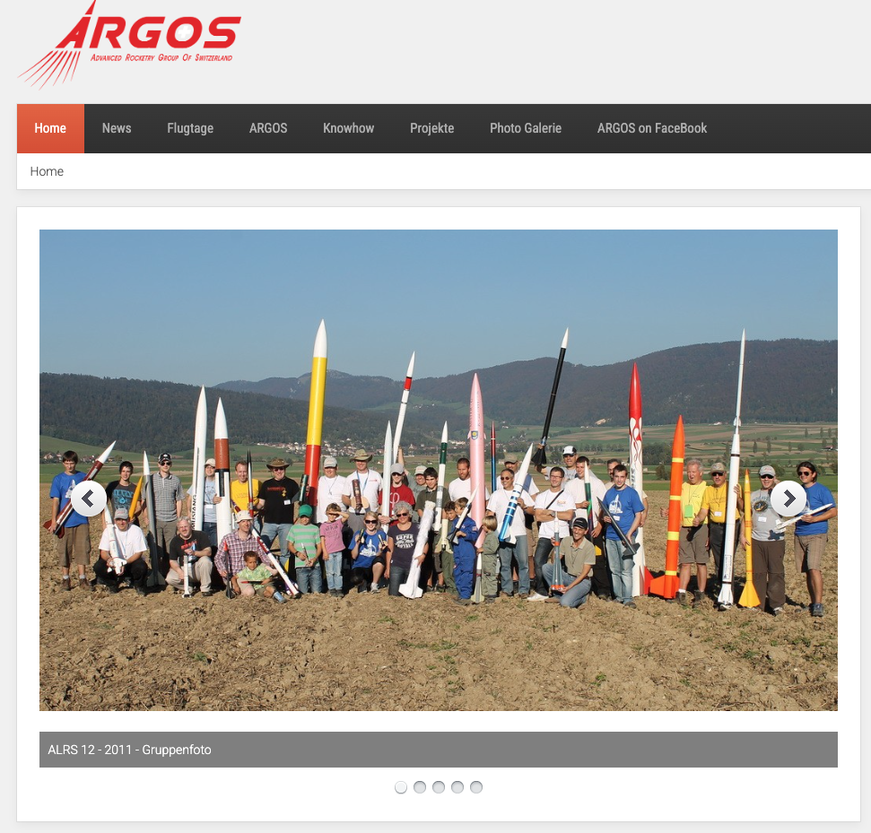
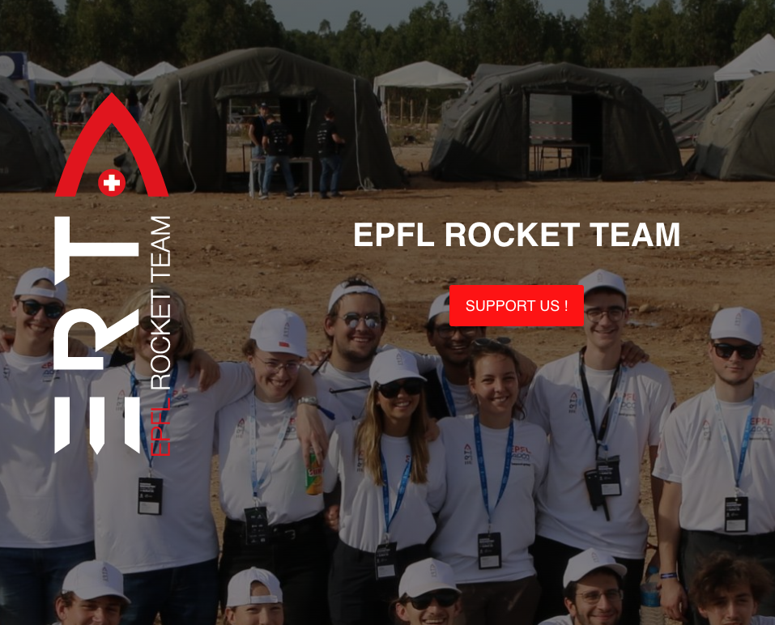
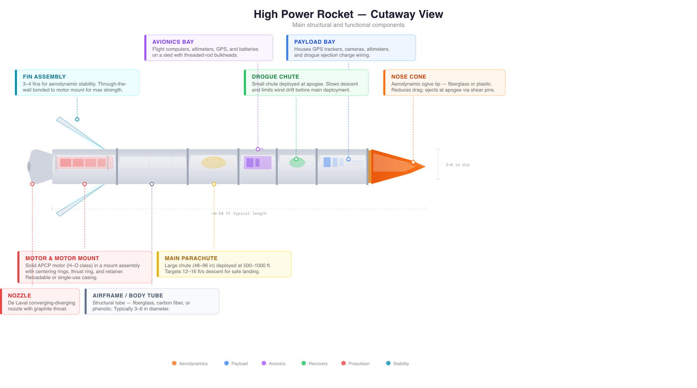
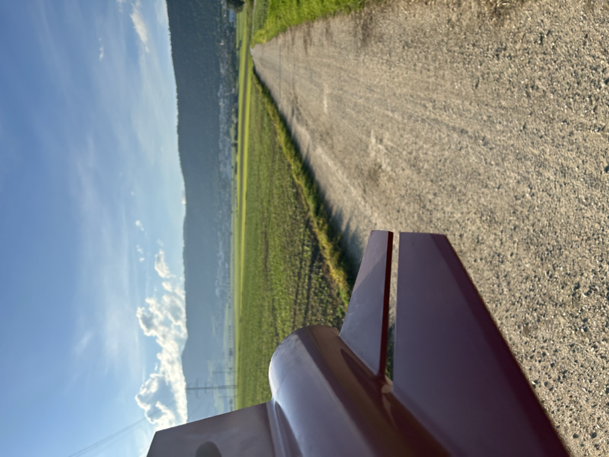
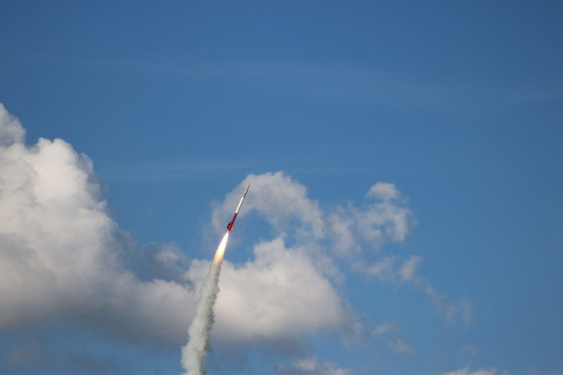

# Some Rocket Science
# First Some Physics

**HES-SO CS/ML Seminar**
*16th February 2026*

*Press 'S' for speaker notes • Arrow keys to navigate*

Note:
Welcome everyone. Today we'll look at a practical problem — stabilising camera footage on model rockets — and how it leads us from Newton's laws all the way to reinforcement learning.

---

## Housekeeping

- Seminar is in two parts, around 45 minutes long in total.
- I want to challenge and inspire, not teach all the details.
- If you want more details, there is a repository for code.
- Please ask me questions whenever you think of them.

Note:
Two parts: first the physics and hardware, then the control and RL. Questions any time — don't hold them until the end.

---

## Objectives

By the end of this seminar, you'll know:

- The basics of rocket flight. <!-- .element: class="fragment" -->
- What "high power" model rockets are, and how they are built. <!-- .element: class="fragment" -->
- How flight can be controlled. <!-- .element: class="fragment" -->
- A practical application of RL — stabilising footage. <!-- .element: class="fragment" -->

Note:
Four things I want you to take away. The last one is where it gets interesting for ML people.

---

## How Rockets Fly

Newton's 3rd law: exhaust goes down, rocket goes up.

Three forces determine acceleration:

$$a = \frac{T - D - mg}{m}$$

Dynamic pressure drives everything aerodynamic:

$$q = \frac{1}{2}\rho v^2$$

Note:
Thrust T from the motor, drag D from air resistance, weight mg from gravity. Dynamic pressure q is the single most important variable in this talk — it determines how much force the air exerts on the rocket. When q is high, control surfaces are effective. When q is low, they're not. IMAGE IDEA: diagram showing forces on a rocket in flight — thrust arrow up, drag arrow down, weight arrow down, with labels.

---

## Flight Profile

  

  

  

  

  

  **Boost** (motor burning)
  - Thrust > drag + weight
  - Velocity increasing
  - High dynamic pressure $q$

  **Coast** (after burnout)
  - No thrust, drag decelerating
  - $q$ drops rapidly
  - Control authority fading

  AeroTech J800T: ~300 m/s (transonic!)

  

  

Note:
The boost phase lasts about 2 seconds on the J800. After burnout, the rocket coasts upward but decelerating. Dynamic pressure — and therefore control effectiveness — drops dramatically. The J800 reaches nearly Mach 1, which introduces compressibility effects.

---

## Why Do Rockets Spin?

<!-- IMAGE: still frame from a spinning rocket camera showing severe rotational blur -->

Sources of unwanted roll:

- Manufacturing asymmetry in fins
- Wind gusts creating differential lift
- Fin misalignment (even 0.5° matters)

Typical roll rate: **20–50 deg/s** — ruins onboard video.

Our goal: keep spin rate below 5 deg/s.

Note:
Even carefully built rockets spin. A fraction of a degree of fin misalignment is enough. At 30 deg/s you get a full rotation every 12 seconds, which creates horrible rolling shutter and motion blur on lightweight action cameras.

---

## Model Rocketry 101

<!-- IMAGE: photo of an Estes rocket next to a high-power rocket for scale comparison -->

Motors classified by total impulse (NAR/TRA):

| Class | Impulse | Category |
|-------|---------|----------|
| A–D | 0–20 N·s | Low power |
| E–G | 20–160 N·s | Mid power |
| H–O | 320+ N·s | **High power** |

E.g. **AeroTech J800T** (~1200 N·s)
- ~1500m altitude, requires certification

Note:
Motor letters double in impulse with each step. A C motor has 5-10 Newton-seconds, a J motor has up to 1280Ns. That's roughly 80x more energy. The J800 is a serious rocket — you need a government licence to fly it.

---

## Model Rocketry Groups In Switzerland

**ARGOS Amateur Rocket Group**

**EPFL Rocket Team**

---

## Anatomy of a Rocket

---

## Anatomy of a Rocket 2

**Structural**
- Nose cone — reduces drag
- Body tube — houses everything
- Fin set — aerodynamic stability
- Motor mount

**Payload**
- Camera (RunCam)
- IMU (ICM-20948)
- Raspberry Pi Zero
- Recovery system (parachute)

Note:
The airframe code mirrors this exactly — NoseCone, BodyTube, TrapezoidFinSet are all classes in the simulation. The real rocket carries a Pi Zero, a gyroscope, a camera, and servo-actuated fin tabs. Plus battery, wiring, and a parachute recovery system.

---

## Building the Rocket

<!-- IMAGE: photo(s) of rocket construction — e.g. fin alignment jig, electronics bay, or partially assembled airframe -->

Note:
Walk through the construction photos here. Talk about the precision needed for fin alignment, the electronics integration, fitting everything inside the body tube, etc. This slide is intentionally image-heavy with minimal text — let the photos do the talking.

---

## Launch Day

<video width="360" height="360" controls>
  <source src="videos/launch_clip.mp4" type="video/mp4">
</video>

Note:
Play the launch video here. Talk through what's happening — ignition, boost phase, you can see the speed, the smoke trail. If the video shows recovery, mention the parachute deployment. This gives the audience a visceral sense of what we're trying to control.

---

## They say it's not a sport...

---

## Why we need control.

---

## The Control Hardware

<!-- IMAGE: photo or CAD render of the servo-mounted fin tab mechanism from rocket-fin-servo-mount/ -->

**Actuators**
- Servo-driven fin tabs
- Trailing edge, **30° max** deflection
- 2 of 4 fins controlled
- Tab: 25% chord × 50% span

**Sensors & Compute**
- ICM-20948 gyroscope, 100 Hz
- ~0.15 deg/s RMS noise
- Raspberry Pi Zero
- 100 Hz control loop

Note:
We only control 2 of the 4 fins. The tabs are small — about a quarter of the fin chord and half the span. The IMU noise is essentially irrelevant compared to the spin rates we're trying to control. All processing happens onboard at 100 Hz.

---

## The Camera System

<!-- IMAGE: photo of the camera electronics setup, or the wiring diagram from camera_electronics/runcam_complete_wiring.svg -->

- **RunCam** action camera with MOSFET trigger modification
- **Dollatek** mod for remote start/stop
- Camera is the whole point — stabilise the footage

**Post-processing pipeline:**

Gyro data → Gyroflow → Stabilised video

Note:
The camera system is modified with a MOSFET so the Pi can trigger recording electronically. Gyroflow is open-source software that uses gyroscope data to computationally stabilise video. But it works much better when the raw spin rate is low — hence our control system.

---

## How Fin Tabs Create Torque

Deflecting a tab increases drag on one side → net roll torque.

$$\tau \propto q \cdot \tanh\!\left(\frac{q}{200}\right) \cdot \delta$$

Control effectiveness varies ~20× during a J800 flight!

flowchart LR
    subgraph "Low deflection fin"
        A["Fin 1 δ = 0°"] --> B["Low drag"]
    end
    subgraph "High deflection fin"
        C["Fin 2 δ = 30°"] --> D["High drag"]
    end
    B --> E["Net torque → Roll correction"]
    D --> E

Note:
This is differential drag, not differential lift. The tab acts like a small spoiler. The tanh term captures the transition from negligible to full effectiveness. At low speed — near apogee — the tabs are almost useless. At peak velocity they're very effective. This 20x variation is the core challenge.

---

## The Control Loop

flowchart LR
    A["IMU (gyroscope)"] -->|"roll rate"| B["Controller"]
    B -->|"tab angle"| C["Servo"]
    C -->|"deflection"| D["Rocket Aerodynamics"]
    D -->|"spin change"| A
    style A fill:#3498db,color:#fff
    style B fill:#e74c3c,color:#fff
    style C fill:#f39c12,color:#fff
    style D fill:#27ae60,color:#fff

- 100 Hz loop (10 ms per cycle)
- Sensor → Controller → Actuator → Physics → Sensor
- The controller is what we need to design

Note:
Classic feedback control loop. The gyroscope measures spin rate, the controller decides what tab angle to command, the servo moves the tab, and the aerodynamics change the spin. We run this 100 times per second. Now — what goes inside that red controller box?

---

## So how do we decide what the controller should do?

Note:
Transition from hardware to algorithms. Two approaches: classical control theory, and reinforcement learning.

---

## PID Control

The most widely-used controller in engineering:

$$u = K_p \, e + K_i \int e \, dt + K_d \, \dot{e}$$

| Term | Question it answers |
|------|-------------------|
| **P** (proportional) | How far off am I? |
| **I** (integral) | Have I been off for a while? |
| **D** (derivative) | How fast is the error changing? |

Setpoint = 0 spin. Error = measured spin rate. Output = tab angle.

Note:
PID is the workhorse of control engineering. P reacts to current error, I corrects for persistent offset, D damps oscillations. For our rocket, the setpoint is zero spin rate. The error is the measured spin rate. The output is a tab deflection angle. You can visualise this as a simple feedback loop: target minus measured goes through PID, output drives the rocket, which feeds back to the sensor.

---

## The Problem with Fixed Gains

<!-- IMAGE: plot showing dynamic pressure variation during J800 flight, with "too weak" and "too aggressive" zones annotated -->

Dynamic pressure $q$ varies **~20×** during flight.

- Gains tuned for **high $q$** → too aggressive at low $q$ → oscillation
- Gains tuned for **low $q$** → too weak at high $q$ → sluggish

Fixed gains cannot work across the full flight envelope.

Note:
This is the fundamental problem. At peak dynamic pressure the fins are 20 times more effective than near apogee. If your P gain is tuned for the middle, it oscillates at peak q and does nothing at low q. We need the gains to adapt.

---

## Gain Scheduling

Scale gains by dynamic pressure to keep loop gain constant:

$$K_p' = K_p \cdot \frac{q_{ref} \cdot \tanh(q_{ref}/200)}{q \cdot \tanh(q/200)}$$

- Same formula for $K_d'$; $K_i$ is **not** scaled
- $q_{ref}$ = reference dynamic pressure (tuned per motor)
- Gains clamped to [0.5×, 5×] to prevent extremes

GS-PID: same algorithm, adapts to flight conditions.

Note:
This is gain scheduling — a standard technique in aerospace. We divide by the current effectiveness and multiply by the reference effectiveness. The tanh captures the nonlinear effectiveness curve. We clamp the scaling to prevent extreme values near zero velocity. The integral gain stays constant because we want consistent offset correction. Kd uses the same scaling formula.

---

## Results: AeroTech J800T (Classical)

Targets NOT met ✗

| Wind (m/s) | PID | GS-PID | Target |
|------------|-----------|-----------|--------|
| 0 | 12.8 ± 0.8 | 10.5 ± 0.8 | < 5 |
| 1 | 13.2 ± 0.9 | 11.0 ± 0.8 | < 10 |
| 2 | 14.4 ± 1.8 | 11.3 ± 0.9 | < 15 |
| 3 | 14.6 ± 1.8 | 11.7 ± 1.2 | < 20 |

GS-PID plateaus at **~10.5 deg/s** — target is **< 5**.

Classical control hits a wall.

Note:
On the J800, even GS-PID can't get below 10.5 deg/s in calm conditions. The target is 5. The higher speeds, the transonic effects, and the stronger wind coupling make this a much harder problem. We need something more capable.

---

## Why Classical Fails on J800

Wind creates a periodic disturbance torque:

$$\tau_{wind} \propto \sin(\theta_{wind} - \psi_{roll})$$

- Torque oscillates at the spin frequency
- PID reacts to error — it cannot **predict** this pattern
- 20× $q$ variation means gain scheduling alone can't compensate

We need something that can learn the disturbance pattern.

Note:
The key insight: wind torque depends on the angle between the wind direction and the rocket's current roll angle. As the rocket spins, this creates a sinusoidal torque. A PID controller can only react after the error appears. It cannot anticipate the next half-cycle. This is a fundamental limitation of reactive feedback control.

---

## The RL Formulation

Gymnasium environment:

**Observation** (10D)
- Position: altitude, velocity
- Roll: angle, rate, acceleration
- Flight: $q$, time, thrust fraction
- Control: previous action, shake

**Action** (1D continuous)

Tab deflection ∈ [-1, 1]

**Reward**

- Bonus for |ω| < 5 deg/s
- Penalty for high spin & jitter

Note:
We formulate this as a standard RL problem. The observation gives the agent everything a real IMU and onboard computer could measure — 10 dimensions total. The action is a single continuous value — how much to deflect the tab. The reward encourages low spin rate with smooth control actions.

---

## Why SAC?

Soft Actor-Critic — good fit for this problem:

- **Off-policy** — sample efficient (reuses past experience)
- **Continuous actions** — natural for servo control
- **Entropy regularisation** — explores naturally

**Core idea:** maximise reward *and* entropy

$$J(\pi) = \sum_t \mathbb{E}\left[r_t + \alpha \, \mathcal{H}(\pi(\cdot|s_t))\right]$$

Note:
SAC is an off-policy actor-critic algorithm. The key innovation is the entropy term — the agent is rewarded for maintaining randomness in its policy, which encourages exploration. Alpha controls the trade-off between reward and entropy. This is important for our problem because the dynamics change throughout the flight.

---

## Attempt 1: Pure SAC

Train SAC end-to-end on J800...

## 0% success rate <!-- .element: class="emphasis" -->
## 91 deg/s mean spin <!-- .element: class="emphasis" -->

What went wrong?

- Action smoothing (α=0.15) killed the signal-to-noise ratio
- Automatic entropy tuning diverged
- Not an algorithm failure — a tuning failure

Note:
First attempt was a disaster. Zero percent success rate, spin rate worse than no controller at all. But this wasn't because SAC can't solve the problem — it was because the hyperparameters were wrong. The action smoothing was too aggressive, making the agent's outputs almost identical regardless of state. And the automatic entropy coefficient shot up, making the policy essentially random.

---

## The Fix: Hyperparameter Tuning

Swept 6 configurations. Key changes:

| Parameter | Before (fail) | After (success) |
|-----------|---------------|-----------------|
| Smoothing α | 0.15 | **0.5** |
| Entropy coef | auto | **0.01** (fixed) |

Before: 0% success, 91 deg/s → After: **100% success, 5.4 deg/s**

Same algorithm. Different hyperparameters. 0% → 100%.

Lesson: always question your setup before blaming the algorithm.

Note:
Two changes made all the difference. Increasing the smoothing alpha from 0.15 to 0.5 let the agent's actions actually vary meaningfully. Fixing the entropy coefficient at 0.01 instead of letting it auto-tune prevented divergence. This is a critical lesson for ML practitioners — when your model fails, the algorithm is rarely the problem.

---

## Residual RL

Key idea: don't replace PID — augment it.

flowchart LR
    O["Observation"] --> PID["GS-PID (base action)"]
    O --> SAC["SAC (residual)"]
    PID --> SUM["+"]
    SAC -->|"× 0.2"| SUM
    SUM --> CLIP["clip [-1, 1]"]
    CLIP --> ENV["Environment"]
    style PID fill:#3498db,color:#fff
    style SAC fill:#e74c3c,color:#fff
    style SUM fill:#f39c12,color:#fff

$$a_{final} = \text{clip}\!\left(a_{PID} + \text{clip}(a_{SAC} \cdot 0.2)\right)$$

SAC can only adjust the PID output by ±20%.

Note:
Residual RL is a general technique. Instead of learning the full control policy from scratch, we start with a known-good controller — our gain-scheduled PID — and let the RL agent learn small corrections on top of it. The 0.2 scaling factor limits the RL agent to ±20% adjustments. This is a powerful inductive bias.

---

## Why Residual RL Works

1. **Inductive bias** — PID encodes domain knowledge

2. **Smaller search space** — only learn the residual

3. **Safe failure mode** — RL outputs zero → still have PID

4. **Faster convergence** — starts from a reasonable policy

A general design pattern: combine classical + learned components.

Note:
This is not specific to rockets. Residual RL is used in robotics, autonomous driving, and process control. The pattern is: take a decent classical controller, let RL learn the bits that the classical approach can't handle. If the RL component fails or encounters an out-of-distribution situation, the classical controller is still there. It's the best of both worlds.

---

## Wind Curriculum

Training in stages — solve easy problems first:

flowchart LR
    S1["Stage 1 No wind"] --> S2["Stage 2 Light (0-1 m/s)"]
    S2 --> S3["Stage 3 Moderate (1-2 m/s)"]
    S3 --> S4["Stage 4 Full (0-3 m/s)"]
    style S1 fill:#27ae60,color:#fff
    style S2 fill:#f39c12,color:#fff
    style S3 fill:#e67e22,color:#fff
    style S4 fill:#e74c3c,color:#fff

**Why?** Credit assignment.

- Full wind from the start → agent can't tell what's working
- Stage by stage → learns basic control, then adapts
- Each stage builds on the previous policy

Note:
Curriculum learning is critical for this problem. If you train with full wind from the start, the agent receives a noisy reward signal and struggles to learn anything. By starting with no wind, it learns the basic relationship between actions and spin rate. Then we gradually introduce wind, and the agent learns to compensate.

---

## Results: RL vs Classical (J800T)

| Wind | GS-PID | Residual SAC | Target |
|------|-----------|-------------|--------|
| 0 | 10.5 ± 0.8 | **3.7 ± 0.1** | < 5 |
| 1 | 11.0 ± 0.8 | **3.9 ± 0.3** | < 10 |
| 2 | 11.3 ± 0.9 | **4.0 ± 0.4** | < 15 |
| 3 | 11.7 ± 1.2 | **4.5 ± 0.8** | < 20 |
| 5 | 12.7 ± 1.7 | **5.6 ± 1.5** | — |

Residual SAC: 2–3× better than best classical controller.

50 episodes, IMU noise. Standalone SAC (5.4 deg/s) also beats classical.

Note:
The numbers speak for themselves. Residual SAC achieves 3.7 deg/s in calm conditions — the target is 5. GS-PID can only manage 10.5. That's a 3x improvement. At 3 m/s wind, residual SAC still meets the target at 4.5 deg/s while GS-PID is at 11.7. Standalone SAC also beats classical by 2x but is less consistent than the residual approach.

---

## Why RL Wins: Implicit Feedforward

The RL agent learns something PID cannot do:

- Roll rate oscillations correlate with wind direction
- The agent can **infer** the periodic disturbance from observations
- It adjusts **predictively** — before the error peaks

PID: reacts *after* the error.
RL: anticipates the *next* error.

The periodic disturbance is learnable.

Note:
This is the key insight of the whole project. The wind torque is periodic — it depends on the angle between wind and roll. An RL agent, seeing the roll angle and roll rate over time, can implicitly estimate where in the cycle it is and pre-compensate. A PID controller has no mechanism for this kind of prediction. This is implicit feedforward control — the agent learned it without being told to.

---

## Video Quality

The whole point — camera footage quality:

- Motion blur = exposure time × roll rate
- At **5 deg/s** → **0.04° blur per frame** (excellent)
- At 10.5 deg/s (GS-PID) → 0.08° blur (noticeable)

<!-- IMAGE: side-by-side comparison of stabilised vs unstabilised rocket camera footage, or Gyroflow screenshot -->

**Pipeline:** Low spin rate → Gyroflow post-stabilisation → Smooth footage

Note:
At 5 deg/s and 1/120s exposure time, each frame has only 0.04 degrees of rotational blur — completely invisible. Gyroflow can then handle the remaining small oscillations in post-processing. The combination of active stabilisation and computational post-processing gives us broadcast-quality footage from a model rocket.

---

## Lessons Learned

1. Simple controllers win most of the time
2. **Hardware upgrades > algorithmic complexity**
3. **RL + classical hybrid > pure RL**
4. **"Algorithm failure" is often tuning failure**
5. **17 advanced approaches tried, most eliminated**

Note:
Five takeaways. First, don't reach for RL when PID works — GS-PID solves the Estes problem completely. Second, sometimes better hardware beats better algorithms — 4 fins plus 200 Hz beats every classical algorithm at baseline hardware. Third, when you do use RL, combine it with classical control — residual SAC outperforms standalone SAC. Fourth, debug your setup before blaming the algorithm — same SAC, 0% to 100% with two hyperparameter changes. And fifth, the final design looks simple, but it took 17 failed approaches to get there. That's engineering.

---

## What's Next

- **Deploy to hardware** — ONNX export for Raspberry Pi (<10ms inference)
- **First flight test** — validate sim-to-real transfer
- **Sim-to-real gap** — aerodynamic model vs reality

<!-- PLACEHOLDER: add your actual next steps or timeline if you want to customise this -->

Note:
The simulation work is done. Next step is deploying to actual hardware. We export the SAC policy to ONNX format for fast inference on the Pi. The big unknown is sim-to-real transfer — how well does our simulated aerodynamic model match reality? That's what the flight test will tell us.

---

## Questions?

<!-- PLACEHOLDER: add your GitHub URL and contact details -->

**Repository:** *github.com/chrispedder/active-guidance-rockets*

Slides built with Reveal.js • Simulation built with Gymnasium + Stable Baselines3

Note:
Thank you. The code is all open source — the simulation, the controllers, the training scripts, everything. Happy to take questions.
